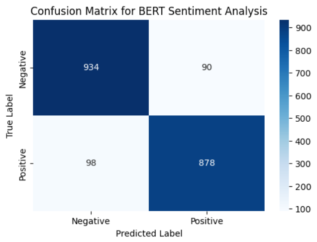
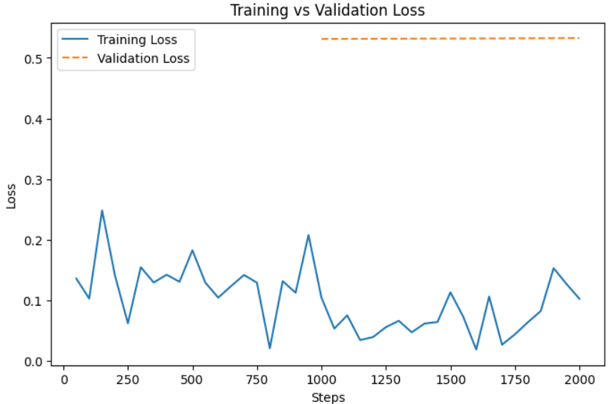
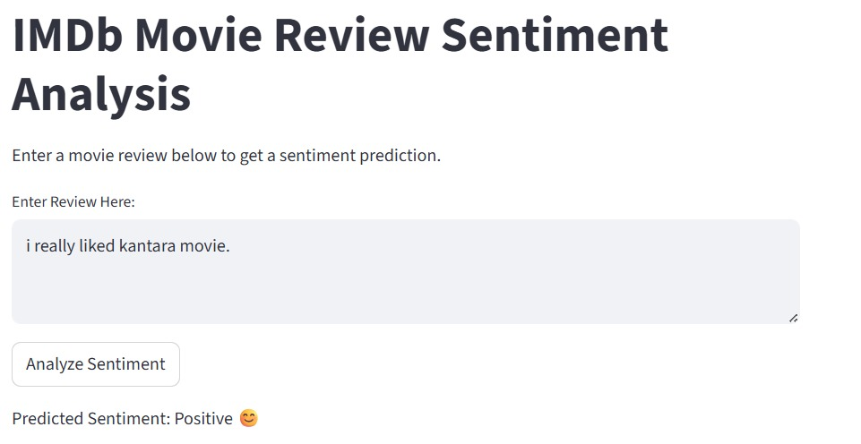

# 🎬 BERT-based Sentiment Analysis for IMDb Movie Reviews

This project implements a sentiment analysis model using BERT (Bidirectional Encoder Representations from Transformers) to classify IMDb movie reviews as positive or negative. The model is trained on the IMDb dataset and includes a Streamlit web interface for real-time predictions.

## 📋 Project Overview

- Fine-tunes BERT for binary text classification
- Uses the IMDb Dataset containing movie reviews
- Implements a web interface using Streamlit
- Achieves high accuracy in sentiment prediction

## 🛠️ Requirements

```
transformers
datasets
torch
scikit-learn
matplotlib
seaborn
pandas
streamlit
```

## 📁 Project Structure

```
NLP_miniproject/
│
├── BERT_Text_Classification_IMDB_Dataset.ipynb   # Main notebook with model training
├── IMDB_Dataset/
│   └── IMDB Dataset.csv                         # Dataset file
└── README.md                                    # Project documentation
```

## 🚀 Setup and Installation

1. Clone the repository:

   ```bash
   git clone [your-repository-url]
   cd NLP_miniproject
   ```

2. Install required Python packages:

   ```bash
   pip install transformers datasets torch scikit-learn matplotlib seaborn pandas streamlit
   ```

3. Download the IMDb dataset and place it in the `IMDB_Dataset` folder

## 🔧 Model Training

The model training process includes:

1. Data preprocessing and tokenization using BERT tokenizer
2. Fine-tuning BERT for sequence classification
3. Training with specified hyperparameters:
   - Learning rate: 2e-5
   - Batch size: 8
   - Training epochs: 2
   - Weight decay: 0.01

## 📊 Features

- Binary sentiment classification (Positive/Negative)
- Real-time prediction through web interface
- Visualization of training metrics:
  - Confusion matrix
  - Training vs Validation loss
  - Performance metrics (accuracy, F1-score, precision, recall)

## 💻 Usage

1. Run the Jupyter notebook to train the model:

   ```bash
   jupyter notebook BERT_Text_Classification_IMDB_Dataset.ipynb
   ```

2. Launch the Streamlit web interface:

   ```bash
   streamlit run app.py
   ```

3. Enter a movie review in the web interface to get sentiment prediction

## 📈 Model Performance

The model achieves competitive performance on the IMDb dataset:

- Evaluates on a test set of 2000 samples
- Provides comprehensive metrics including:
  - Accuracy
  - F1-score
  - Precision
  - Recall

### Visualization Results

#### Confusion Matrix


_Confusion matrix showing the model's prediction performance on positive and negative reviews_

#### Training Progress


_Training vs Validation Loss across training steps_

### Sample Web Interface


_Web interface for real-time sentiment analysis_

## 🤝 Contributing

Feel free to fork this repository and submit pull requests. You can also open issues for bugs or feature requests.

## 📄 License

This project is licensed under the MIT License - see the LICENSE file for details.

## 👏 Acknowledgments

- The IMDb Dataset for providing the training data
- Hugging Face for the transformers library
- The BERT team at Google Research
